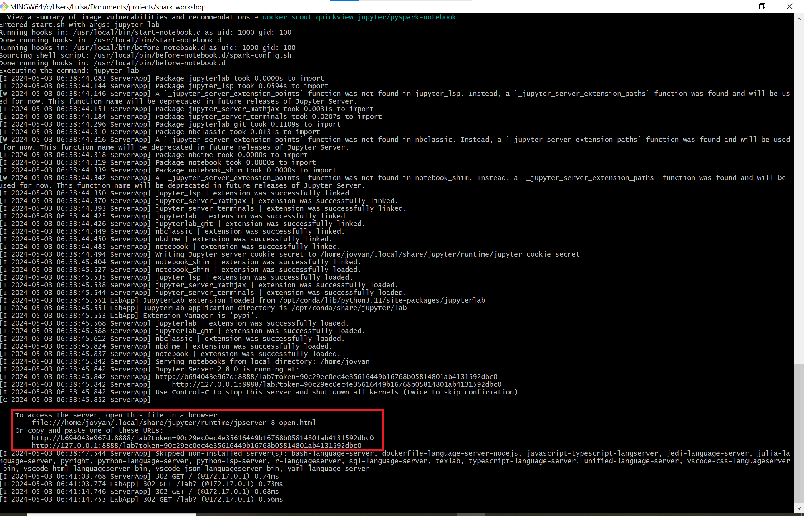

# Spark Workshop

This workshop is scheduled for the week of June 17th to 21st, 2024.

<!-- TABLE OF CONTENTS -->
<details>
  <summary>Table of Contents</summary>
  <ol>
    <li>
      <a href="#about-the-Workshop">About The Workshop</a>
      <ul>
        <li><a href="#built-with">Built With</a></li>
      </ul>
    </li>
    <li>
      <a href="#getting-started">Getting Started</a>
      <ul>
        <li><a href="#prerequisites">Prerequisites</a></li>
        <li><a href="#installation">Installation</a></li>
      </ul>
    </li>
    <li><a href="#license">License</a></li>
    <li><a href="#data">Data</a></li>
    <li><a href="#contact">Contact</a></li>
    <li><a href="#acknowledgments">Acknowledgments</a></li>
  </ol>
</details>

<!-- ABOUT THE Workshop -->
## About The Workshop

Join us for an engaging Spark workshop tailored for beginners, where we'll dive into both theoretical concepts and practical application. Delve into the fundamental principles of Spark, learning about its architecture, data processing capabilities, and use cases. Then, roll up your sleeves for hands-on practice, where you'll apply what you've learned in real-world scenarios. By the end of the workshop, you'll have a basic understanding of Spark and the confidence to start building your own data processing pipelines.

<p align="right">(<a href="#readme-top">back to top</a>)</p>

### Built With

This section enumerates the primary frameworks/libraries employed to initiate the workshop.

* [![Docker][Docker-shield]][Docker-url]
* [![GitHub][Github-shield]][Github-url]   


<p align="right">(<a href="#readme-top">back to top</a>)</p>

<!-- GETTING STARTED -->
## Getting Started

Begin by following these detailed guidelines to set up your local environment seamlessly. These instructions will walk you through the process, ensuring a smooth start to your local development journey.

### Prerequisites

Please Pre-install the following software:

- Git
- IDE (e.g., VS Code or IntelliJ)
- Docker Desktop (Please refer to the instructions below based on your operating system.)

#### Windows

Two methods are available for installing Docker Desktop on Windows: using WSL or Hyper-V. Both approaches are outlined below in Step 1.

1. Choose one of the described options and install all necessary functions.
    <br>
    <details>
    <summary>(Recommended) Running Docker Desktop on Windows with WSL</summary>

      Open Windows Powershell as Administrator and run the following commands:

      ```sh
      wsl --install
      ```
      The first time you launch a newly installed Linux distribution, a console window will open and you'll be asked to wait for files to de-compress and be stored on your machine.
      Once you have installed WSL, you will need to create a user account and password for your newly installed Linux distribution.

      > :warning: **Occasionally, Ubuntu installation may terminate unexpectedly, displaying an Error Code (e.g., Error code: Wsl/InstallDistro/E_UNEXPECTED). In such cases, you may need to enable Virtual Machine within your CPU Configurations in the BIOS or activate Virtual Environment in Windows Features!**

    </details>
    <br>

    <details>
    <summary>Running Docker Desktop on Windows with Hyper-V backend</summary>

      Open Windows Powershell as Administrator and run the following commands:
      ```sh
      Enable-WindowsOptionalFeature -Online -FeatureName Microsoft-Hyper-V -All
      Enable-WindowsOptionalFeature -Online -FeatureName Containers -All
      Enable-WindowsOptionalFeature -Online -FeatureName VirtualMachinePlatform -All
      ```
    </details>
    <br>

2. Donwload the Docker Desktop file from the Docker Website and follow instructions.

3. After installation open Docker Desktop.

#### Mac/Linux

1. Donwload the Docker Desktop file from the Docker Website and follow instructions. 

2. After installation open Docker Desktop.


### Installation

Please follow the instructions to setup your local programming environment. These guidelines will ensure that you have all the necessary tools and configurations in place for a smooth and efficient development experience during our workshop. 

1. Obtain a free Personal Access Token (PAT) from [https://docs.github.com/PAT](https://docs.github.com/en/enterprise-server@3.9/authentication/keeping-your-account-and-data-secure/managing-your-personal-access-tokens) and use it to authenticate yourself locally.
2. Clone the repository of our spark workshop.
   ```sh
   git clone https://github.com/CorrelAid/spark_workshop.git
   ```
3. Open a bash terminal and navigate directly to the root directory of your locally cloned repository. From there, install and activate the PySpark Environment using the following command:

    ```sh
    sh run_setup.sh
    ```
4. Access the port via a web browser:
  
    ```sh
    http://localhost:10001:
    ```

5. Enter the token as the password. You can find the token displayed in the terminal, as illustrated in the image below.:
    
    If you are not sure what the token is you can open another bash terminal and execute:
    
    ```sh
    docker logs pyspark_workshop | grep -o 'token=[^ ]*'
    ```
    
    This command will display all logs from your recently created Docker container containing the token. Simply look for the section where "token=" is mentioned.

  <div align="center">
  <a href="https://github.com/CorrelAid/spark_workshop/">
    
  </a>
  <p align="center">
    Sample Output: Screenshot of Terminal Display Post-Execution of run_setup.sh - Featuring Token and Port Information
  </p>
  </div>
    
    

<p align="right">(<a href="#readme-top">back to top</a>)</p>

<!-- LICENSE -->
## License

Distributed under the MIT License. See `LICENSE.txt` for more information.

<p align="right">(<a href="#readme-top">back to top</a>)</p>


<!-- DATA -->
## Data 
The data originates from a freely available dataset on Kaggle:
[https://kaggle/grocery-dataset](https://www.kaggle.com/datasets/elvinrustam/grocery-dataset?resource=download)

<!-- CONTACT -->
## Contact

Pia Baronetzky - [@Pia Baronetzky](https://correlaid.slack.com/team/U012LQGV81K) - pia@baronetzky.org <br>
Daniel Manny - [@Daniel Manny](https://correlaid.slack.com/team/U013SMVNJJ1) - dmanny10@gmail.com<br>
Jie Bao - [@Jie Bao](https://correlaid.slack.com/team/U9L0H3J3Z) - jie.bao@gmail.com<br>
Luisa-Sophie Gloger - [@Luisa-Sophie Gloger](https://correlaid.slack.com/team/U06SBUAJ2HL) - luisa.gloger@gmx.de<br>

Project Link: [https://github.com/CorrelAid/spark_workshop](https://github.com/CorrelAid/spark_workshop)

<p align="right">(<a href="#readme-top">back to top</a>)</p>


<!-- ACKNOWLEDGMENTS -->
## Acknowledgments

* [Kaggle](https://www.kaggle.com)
* [Choose an Open Source License](https://choosealicense.com)
* [GitHub Emoji Cheat Sheet](https://www.webpagefx.com/tools/emoji-cheat-sheet)
* [Malven's Flexbox Cheatsheet](https://flexbox.malven.co/)
* [Malven's Grid Cheatsheet](https://grid.malven.co/)
* [Img Shields](https://shields.io)
* [GitHub Pages](https://pages.github.com)
* [Font Awesome](https://fontawesome.com)
* [React Icons](https://react-icons.github.io/react-icons/search)

<p align="right">(<a href="#readme-top">back to top</a>)</p>

<!-- MARKDOWN LINKS & IMAGES -->
<!-- https://www.markdownguide.org/basic-syntax/#reference-style-links -->
[Docker-shield]: https://img.shields.io/badge/Docker-2CA5E0?style=for-the-badge&logo=docker&logoColor=white
[Docker-url]:https://www.docker.com/#build
[Github-shield]:https://img.shields.io/badge/GitHub-100000?style=for-the-badge&logo=github&logoColor=white
[Github-url]:https://github.com/    